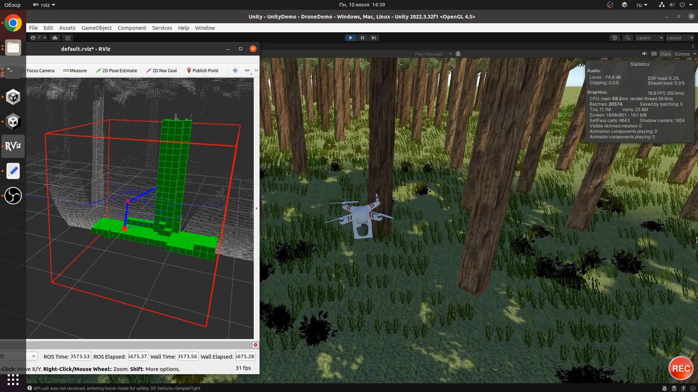
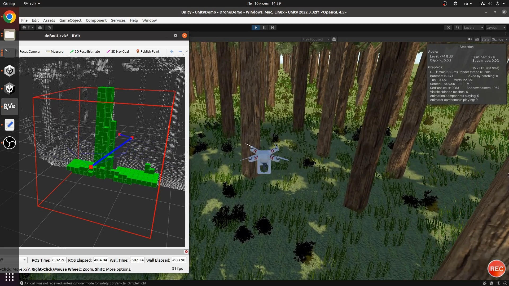
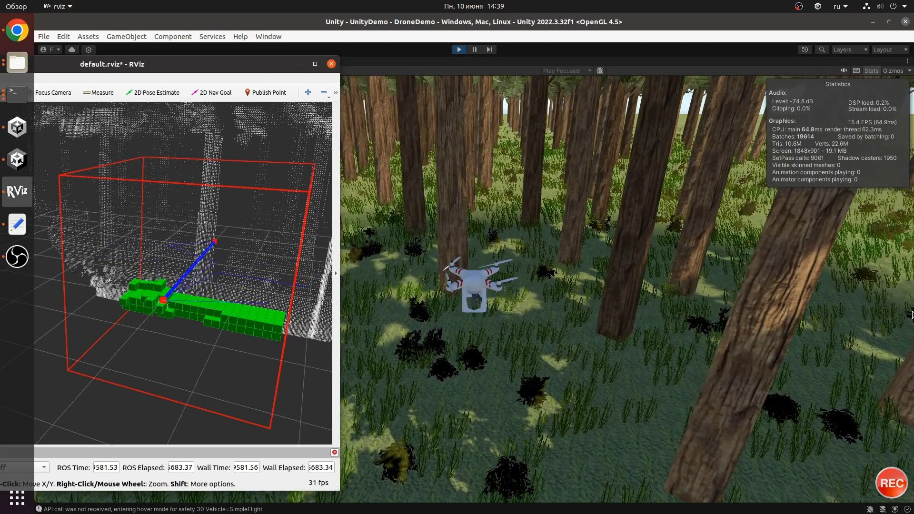

**SMARTSIGHT** — проект, направленный на создание системы автономного безопасного пролета БПЛА через лесные зоны. Система использует камеры глубины и алгоритмы построения маршрута, такие как Rapidly-exploring Random Tree (RRT*), для навигации через труднопроходимые участки, обеспечивая облёт препятствий в реальном времени.

## Скриншоты работы в AirSim

